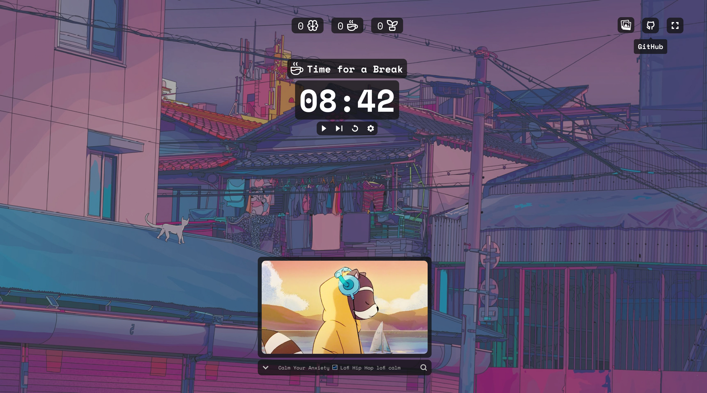

# 🍅 PomoTunes

PomoTunes is a productivity app that combines the Pomodoro technique with music streaming from YouTube. 🎧📈 With PomoTunes, you can stay focused and productive while enjoying your favorite music. 🎶💻

 

## Features

1.  🕰️👨‍💻 Pomodoro timer: Set your work intervals and break intervals with ease.
2.  🎶🎵 YouTube music streaming: Choose from a selection of pre-defined music streams or create your own custom playlists.
3.  🌗🌞 Dark and light mode: Switch between dark and light themes for better visibility in different lighting conditions.
4.  📱💻 Responsive design: PomoTunes is optimized for desktop and mobile devices, so you can use it wherever you are.

## Tech Stack

PomoTunes is built with the following technologies:

-  [React](https://react.dev/)
-  [Vite](https://vitejs.dev/)
-  [TypeScript](https://www.typescriptlang.org/)
-  [Tailwind CSS](https://tailwindcss.com/)
-  [YouTube API](https://developers.google.com/youtube)

## Installation

To install PomoTunes on your local machine, follow these steps:

1.  Clone the repository: `git clone https://github.com/Infected-by-js/PomoTunes.git`
2.  Install the dependencies: `npm install`
3.  Start the development server: `npm run dev` 🚀
